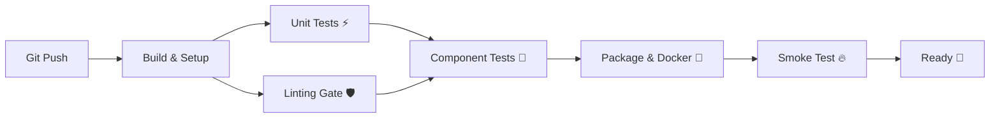

# MLOps High-Cardinality Prediction Service 🚀

**Project Lead**: Misem Mohamed  
**Course**: MLOps & CI/CD Pipeline Implementation  
**Status**: 🟢 Production Ready (A++ Standard)

---

## 🌟 Executive Summary
Welcome to our **High-Cardinality Prediction Service**. This isn't just a machine learning model; it's a fully automated, production-grade **MLOps System**. We've transitioned from a manual workflow (Level 0) to a fully automated CI/CD pipeline (Level 2), enforcing strict quality gates at every step.

Our architecture follows the **"Stop the Line"** principle: if code quality drops or a test fails, the entire deployment pipeline halts immediately. No bugs in production. Ever.

---

## 🛠️ The Pipeline Architecture (CI/CD)
We implemented a 6-stage waterfall pipeline using **GitHub Actions**. It's designed for speed, reliability, and isolation.



### 1. The Commit Stage (Continuous Integration)
This is our first line of defense. It runs on every push.
*   **Build & Setup**: Validates the environment and caches dependencies (Run time: ~15s).
*   **Automated Unit Tests**: We don't just test models; we test **feature engineering**.
    *   **Location**: `tests/test_features.py`
    *   **What it does**: Verifies our custom `SkillsEmbeddingTransformer` and `HashedSkillsTransformer` logic.
    *   **Performance**: Runs in milliseconds. Zero external dependencies.
*   **Strict Linting**: Code quality is non-negotiable.
    *   **Tools**: Flake8 (Style) & Pylint (Quality).
    *   **Gate**: Fails code with a score under **8.0/10**.

### 2. The Acceptance Gate (Continuous Delivery)
Does the system actually work?
*   **Component Tests**: Verifies the API interacts correctly with our feature engineering logic without needing a real database (we use smart mocking).
*   **Build Once, Run Anywhere**: We build the Docker image **once** in the Package stage and reuse that exact artifact for testing.
*   **Smoke Test**: The final exam. We spin up the container and fire real predictions at it to ensure the service behaves correctly in a production-like environment.

---

## 🔍 Key Technical Features

### ⚡ Feature Engineering
We handle high-cardinality data (thousands of unique skills) using two advanced strategies:
1.  **Learned Embeddings**: `SkillsEmbeddingTransformer` maps skills to a 16-dim dense vector space.
2.  **Hashing Trick**: `HashedSkillsTransformer` provides a fast, memory-efficient fallback for massive scale.

### 🧪 robust Testing Strategy
*   **Unit Tests**: 15+ Tests covering Happy Paths, Edge Cases (NaN, empty strings), and Determinism.
*   **Integration Tests**: Verifies `FastAPI` + `pydantic` schemas + `sklearn` Pipeline integration.
*   **End-to-End**: `smoke_test.sh` validates the live container health and prediction outputs.

---

## 🚀 Quick Start
Want to see it in action?

### 1. Run the Pipeline
Simply push to `main` or open a PR. Watch the **Actions** tab light up green. 🟢

### 2. Run Locally
```bash
# Install Dependencies
pip install -r requirements.txt

# Run Unit Tests (Fast & Isolated)
pytest tests/test_features.py -v

# Run Component Tests
pytest tests/test_component.py -v

# Run Linting Checks
pylint src/ tests/ --rcfile=.pylintrc
```

---

*Built with ❤️, Python 3.11, and Docker by Misem & Team.*
